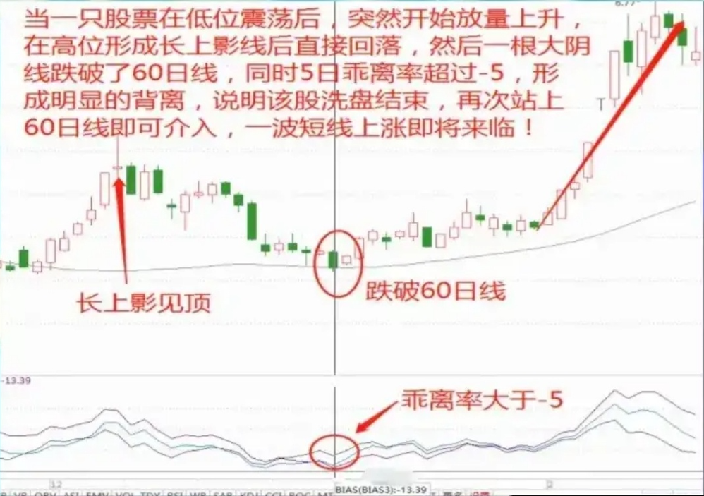

### 回军之师

> 股价首次放量突破5日线后,突然某一日跌破5日线,这时候当他企稳10日线后再次突破5日线则是最佳的短线介入点，行情一般会更猛!

### 火眼金睛

> 股价前期经过一轮大跌后突然放量站上5日线,但是随后再次跌破,虽然股价看似回落,但是 BIASicon 指标(乖离率)已经出现了明显底背离,说明股价偏离均线过远,那么一旦股价再次出现企稳 K 线后再次站上5日线则就是短期介入点,后市将出现一波大涨行情!

### 落地开花

> 当一只股票经过连续下跌后,突然在低位出现一根倒锤头线icon,这时候就是一个短线的介入信号,因为后期都会突然一波短线上攻行情。

### 猪笼入水

> 当一只股票在低位震荡后,突然开始放量上升,在高位形成长上影线icon后直接回落,然后一根大阴线跌破了60日线,同时5日乖离率超过-5,形成明显的背离,说明该股洗盘结束,再次站上60日线即可介入,一波短线上涨即将来临!

### 上升三法

> 股价在上涨突破突然放量收出一根大阳线然后再次出现三根带有下影线的小阴星最后再次放量收阳,这一般是主力拉升前的洗盘,是短线介入最佳机会后市将会大涨!

### 双龙出海

> 当一只股票在上涨途中出现连续两根阳线并排时，短线果断介入，第二天不出意外就会大涨!

### 金线腾空

> 当一只股票在连续缩量下跌后,在没有重大利好消息的刺激下,股价突然大幅高开,然后第二天却再次返回原先的轨道上继续上升,这种往往是短庄介入信号,短线可以逢低介入,接下来行情势必会出现一波大涨!

### 仙人指路

> 股价在上升趋势中如果突然收出一根长长上影线icon但是趋势并没有走坏,那么这根上影线出现时果断介入,他将指明后市的方向以及股价位置(突破这根上影线高点)！

### 星星相印

> 当一只股票在下跌末端出现三根或者三根以上十字小阳星或者小阴星时,并且几乎水平排列时,同时成交量出现地量,这基本上就是短线见底信号,一旦出现大阳即可介入。

